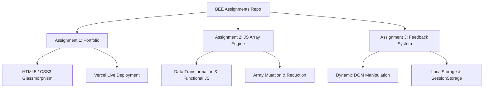

<div align="center">

  # ✦ BEE ASSIGNMENTS ✦
  
  <p align="center">
    <strong>A Curated Collection of Web Development, JavaScript Data Structures & Interactive Applications</strong>
  </p>

  <br />

  <p align="center">
    <a href="#-assignments-overview">📁 Assignments</a> •
    <a href="#-tech-stack">🛠️ Tech Stack</a> •
    <a href="#-repository-structure">📂 Structure</a> •
    <a href="#-quick-start">🚀 Quick Start</a> •
    <a href="#-author">👤 Author</a>
  </p>

  <p align="center">
    
    
    
    
    
  </p>

</div>

---

## 📌 Repository Overview

Welcome to the official repository for **BEE (Backend Engineering & Web Development)** course assignments by **Parv Sood**. This repository serves as a showcase of modern web development principles, JavaScript array manipulation algorithms, responsive UI design systems, and client-side web storage mechanisms.

> [!NOTE]
> All assignments are crafted focusing on **clean code standards**, **semantic HTML5**, **modular JavaScript (ES6+)**, and **responsive design practices**.

---

## 📚 Assignments Overview

| Assignment | Title / Topic | Primary Focus & Concepts | Live Demo / Preview |
| :---: | :--- | :--- | :---: |
| **`assignment1`** | **Personal Portfolio Website** | Editorial UI, Glassmorphism, 22-Language Preloader, CSS Grid, Responsive Design | [🌐 Live Demo](https://parv-portfolio-website.vercel.app/) |
| **`assignment2`** | **Student Management System** | JS Data Structures, Array Methods (`push`, `splice`, `map`, `filter`, `reduce`, `sort`) | [📄 View Code](./assignment2/) |
| **`assignment3`** | **Dynamic Feedback System** | Form Validation, DOM Manipulation, Browser LocalStorage & SessionStorage | [📄 View Code](./assignment3/) |

---

### 🎨 Assignment 1: Cinematic Digital Portfolio
> **Directory**: [`/assignment1`](./assignment1/) &nbsp;|&nbsp; **Live Site**: [parv-portfolio-website.vercel.app](https://parv-portfolio-website.vercel.app/)

- **Overview**: An editorial, Apple-inspired interactive personal portfolio built for high performance and visual elegance.
- **Key Features**:
  - 🌐 Multilingual 22-language preloader sequence with interactive progress tracking.
  - 🌌 Deep dark mode palette (`#090909`), custom glassmorphic cards, and subtle accent glows.
  - 🎯 Modular section architecture: About, Skills Matrix, Filterable Projects, Publications, and Contact Form.
- **Tech Stack**: HTML5, Vanilla CSS3 (Custom Tokens & Keyframes), ES6+ JavaScript.

---

### ⚡ Assignment 2: Student Management System (JS Array Engine)
> **Directory**: [`/assignment2`](./assignment2/)

- **Overview**: A JavaScript application demonstrating full mastery over core JS array methods and functional data processing.
- **Key Algorithms & Operations Implemented**:
  - **Mutation Methods**: `push()`, `pop()`, `unshift()`, `shift()`, `splice()`
  - **Immutable Extraction & Iteration**: `slice()`, `for...of`, `forEach()`
  - **Functional Programming**: `map()` (name extraction), `filter()` (topper filtering $\ge 80$), `reduce()` (sum & average calculations)
  - **Sorting**: Multi-pass numerical sorting in ascending and descending order using `sort()`
- **Files**: `assignment2.html`, `assignment2.js`

---

### 📝 Assignment 3: Dynamic Student Feedback System & Local Storage
> **Directory**: [`/assignment3`](./assignment3/)

- **Overview**: An end-to-end interactive feedback collection portal with client-side form validation, real-time rendering, and client storage.
- **Key Features**:
  - 🔒 Dynamic validation rules for name length, email format regex, dropdown selections, and character counts.
  - 💾 Browser **LocalStorage** integration for persistent user feedback records across sessions.
  - ⏱️ **SessionStorage** implementation to track active session activity.
  - 🗑️ One-click stored data flush & dynamic UI feedback updates.
- **Files**: `1.html`, `1.css`, `1.js`

---

## 🛠️ Tech Stack & Capabilities



- **Languages**: HTML5, CSS3, JavaScript (ES6+)
- **Design Concepts**: Dark Mode Aesthetics, Glassmorphism, Responsive Grid Systems, Accessible Typography
- **Storage & State**: Browser `localStorage`, `sessionStorage`, In-Memory State Management
- **Deployment**: Vercel (`assignment1`)

---

## 📂 Repository Structure

```bash
BEE-ASSIGNMENTS/
├── 📁 assignment1/             # Assignment 1: Personal Portfolio Website
│   ├── 📁 assets/              # Images, icons, and background meshes
│   ├── 📁 css/                 # Modern design tokens & layout stylesheets
│   ├── 📁 js/                  # Preloader timeline & interactive scripts
│   ├── index.html              # Main single-page application structure
│   ├── ParvSood-Resume.pdf     # Professional Resume
│   └── README.md               # Detailed portfolio documentation
│
├── 📁 assignment2/             # Assignment 2: Student Management System
│   ├── assignment2.html        # Console host interface
│   └── assignment2.js          # JS Array algorithms & data manipulation
│
├── 📁 assignment3/             # Assignment 3: Student Feedback Portal
│   ├── 1.html                  # Feedback form markup
│   ├── 1.css                   # Form styling & error alert themes
│   └── 1.js                    # Storage engine & input validator
│
└── README.md                   # Repository Master Documentation
```

---

## 🚀 Quick Start & Local Execution

To inspect or run any assignment locally:

```bash
# 1. Clone the repository
git clone https://github.com/parvvsood/BEE-ASSIGNMENTS.git

# 2. Navigate to the project directory
cd BEE-ASSIGNMENTS

# 3. Open any assignment:
# Open Assignment 1 Portfolio
open assignment1/index.html

# Open Assignment 2 Console Host
open assignment2/assignment2.html

# Open Assignment 3 Feedback Portal
open assignment3/1.html
```

---

## 👤 Author & Academic Details

**Parv Sood**  
🎓 Student | BE AI / Computer Science & Engineering  
🌐 **Portfolio**: [parv-portfolio-website.vercel.app](https://parv-portfolio-website.vercel.app/)  
🐙 **GitHub**: [@parvvsood](https://github.com/parvvsood)  

<br />

<div align="center">
  <sub>Designed & Maintained with precision by <strong>Parv Sood</strong></sub>
</div>